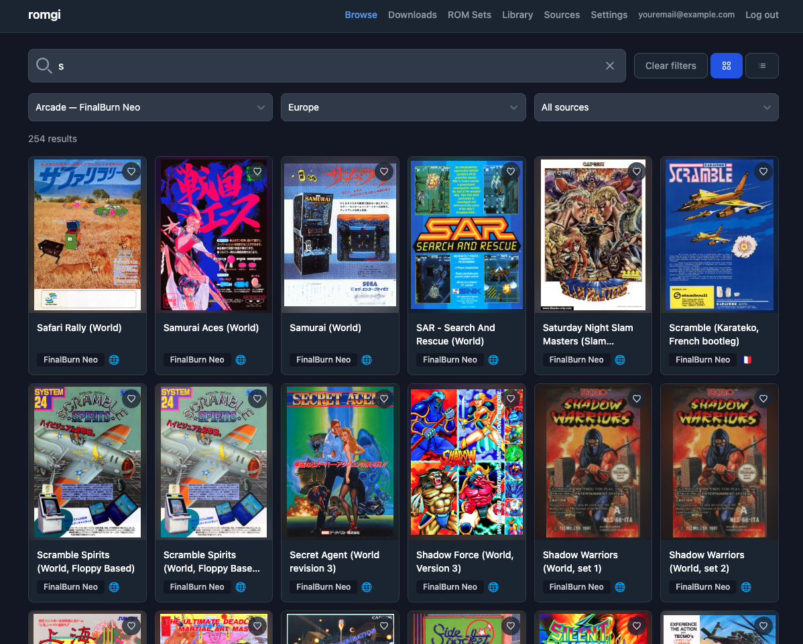
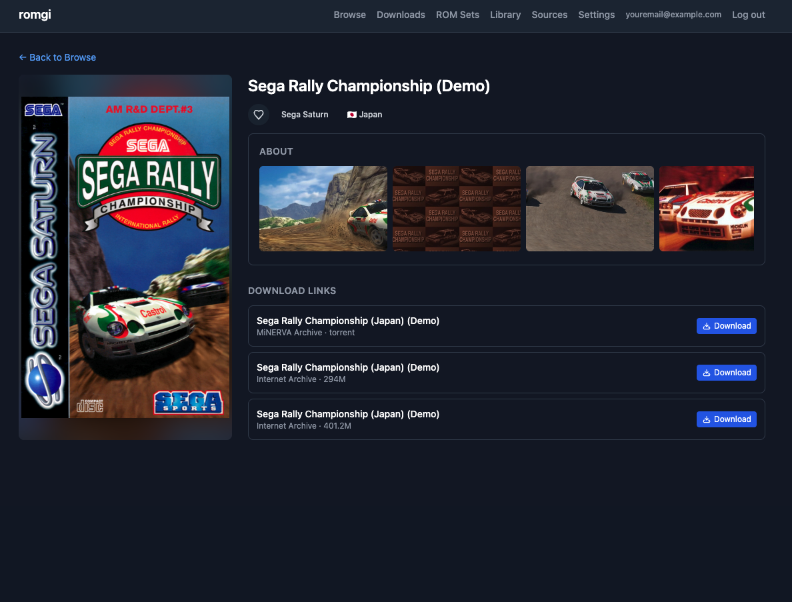
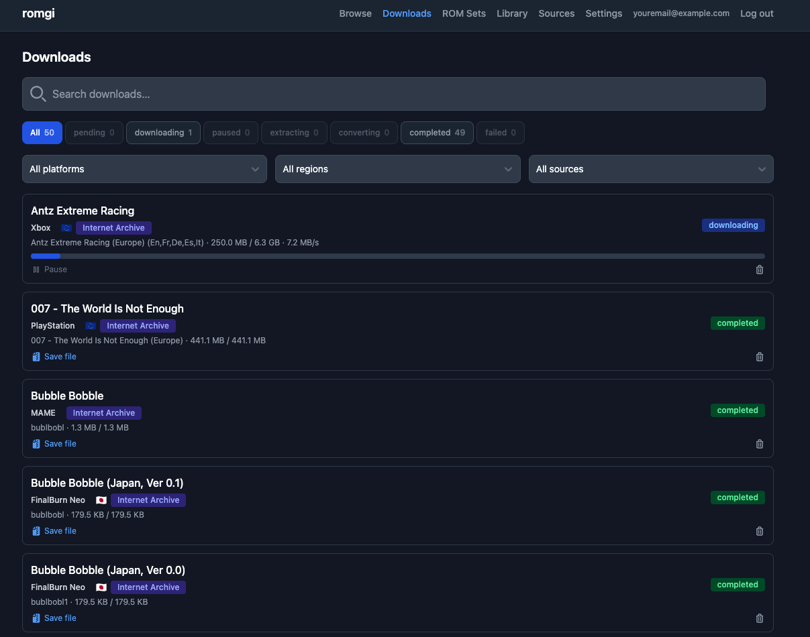
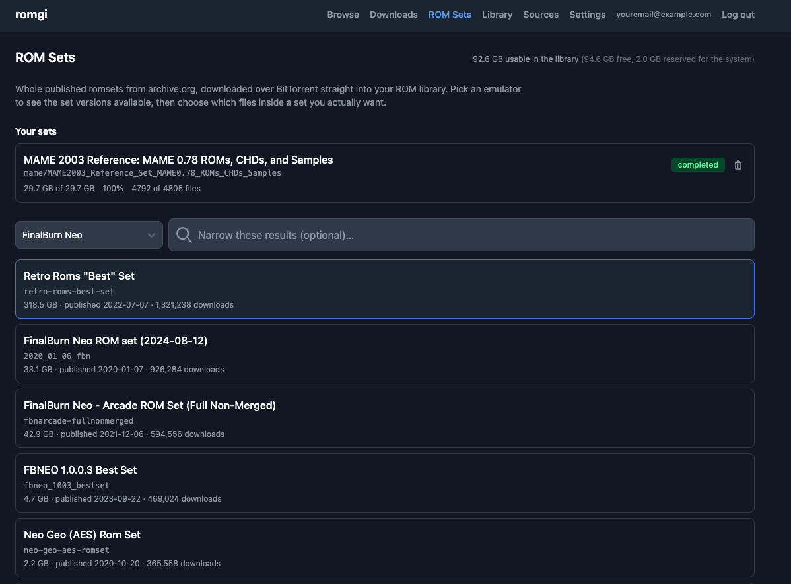

# romgi-web

A self-hosted web app for browsing and downloading ROMs you legally own.
Django + SvelteKit, running under Docker Compose — a web port of
[romgi](https://github.com/caprado/romgi), a Flutter/Android ROM downloader.

Downloads run over plain HTTP, BitTorrent (via qBittorrent), or a debrid
provider (Real-Debrid/TorBox), with live progress in the browser, optional
archive extraction, Internet Archive login for restricted content, and
optional game metadata enrichment (ScreenScraper/SteamGridDB).

> **This project ships no ROMs and hosts no files.** It indexes publicly
> available sources and drives downloads on your own hardware, using your own
> accounts and credentials. What you download, and whether you're entitled to
> it, is between you and the law where you live.

## Screenshots

| Browse | Entry detail |
|---|---|
|  |  |

| Downloads | ROM sets |
|---|---|
|  |  |

## Features

- **Catalog browse and search** across multiple ROM sources, filterable by
  platform and region.
- **Three download paths** — direct HTTP, BitTorrent through a bundled
  qBittorrent daemon, or a debrid provider — with automatic link ranking and
  failover between them.
- **Live progress over WebSocket**, so a running download updates in place
  rather than on refresh.
- **[ROM sets](docs/romsets.md)** — browse whole published romsets on
  archive.org by emulator (FBNeo, MAME, …) and fetch one as a unit, instead of
  a file at a time. Per-file selection, so a 5GB file you don't want is never
  transferred.
- **Metadata enrichment** from ScreenScraper/SteamGridDB, with box art and a
  local cache.
- **Favorites and recently-viewed**, per user.
- **Invite-only multi-user auth** — no open signup, per-account lockout,
  rotating refresh tokens, and a credential vault encrypted at rest.
- **Internet Archive login** for items in the `loggedin` collection.

## Architecture

- **Backend**: Django 5.1 + Django Ninja (REST API) + Django Channels
  (WebSocket progress) + Celery (background work: ingestion, downloads,
  torrents, credential/metadata calls) + PostgreSQL + Redis.
- **Frontend**: SvelteKit (Svelte 5, CSR-only) + FlowbiteSvelte + Tailwind CSS v4.
- **Torrents**: a qBittorrent-nox daemon, driven via its Web API. Both the
  per-ROM downloads and the ROM-set downloads drive it, and qBittorrent
  dedupes by infohash — so `apps/torrents/ownership.py` is the single place
  that decides whether a torrent is still wanted before anything stops or
  deletes it.
- **Catalog ingestion**: a vendored copy of the original app's Python ETL
  pipeline (`backend/apps/ingestion/pipeline/`), writing into Postgres
  instead of a SQLite file.

A per-app breakdown of the tree is in [docs/development.md](docs/development.md#code-layout).

## Quick start

Requires Docker and Docker Compose.

```bash
cp backend/.env.example backend/.env
```

Set two values in `backend/.env`:

```bash
# SECRET_KEY
python -c "from django.core.management.utils import get_random_secret_key; print(get_random_secret_key())"

# ENCRYPTION_KEY
python -c "from cryptography.fernet import Fernet; print(Fernet.generate_key().decode())"
```

> If either generated value contains a `$`, escape it as `$$` — Docker Compose
> interpolates `.env` values and will otherwise corrupt the key silently. See
> [docs/installation.md](docs/installation.md#environment).

```bash
docker compose up --build
```

| Service | URL |
|---|---|
| Frontend | http://localhost:5174 |
| Backend API | http://localhost:8001/api |
| Backend admin | http://localhost:8001/admin |
| qBittorrent WebUI | http://localhost:8080 |

Registration is invite-only, so the first account comes from the shell:

```bash
docker compose exec django python manage.py createsuperuser

# Prints a signup link to send to the new user.
docker compose exec django python manage.py createinvite --email someone@example.com
```

The catalog starts empty — ingest a source to fill it:

```bash
docker compose exec django python manage.py ingest_catalog --sources mariocube
```

Two more setup steps matter before torrents work (qBittorrent's first-boot
password) and before downloads land somewhere you can reach them (the library
bind mount) — both are in [docs/installation.md](docs/installation.md).

## Documentation

| | |
|---|---|
| [Installation](docs/installation.md) | Full configuration, first account, qBittorrent handshake, loading a catalog |
| [Development](docs/development.md) | Running backend/frontend on the host, VS Code debug configs, tests, code layout |
| [ROM sets](docs/romsets.md) | How whole-romset downloads work, and the disk-space rules that govern them |
| [Deployment](docs/deployment.md) | Production settings and the auth model |
| [Known issues](KNOWN_ISSUES.md) | What's unverified, deliberately unimplemented, or worth a second look before relying on this in production |

`KNOWN_ISSUES.md` is worth reading first if you're evaluating this — several
integrations were built as faithful ports but never observed succeeding
against the real service, and it says exactly which.

## Credits

Ported from [caprado/romgi](https://github.com/caprado/romgi) (MIT
License, © 2025 Christian Prado) — the catalog ingestion pipeline, download
state machine, link-ranking/failover logic, torrent handling, debrid
resolution, Internet Archive login flow, and metadata provider integrations
are all adapted from that project's Dart/Kotlin/Python source, reimplemented
here in Python (Django/Celery) and TypeScript (SvelteKit). The original
project isn't vendored in this repo (it's reference material, not a runtime
dependency) — see its GitHub page for the original Android app.

## License

MIT — see [LICENSE](LICENSE).
